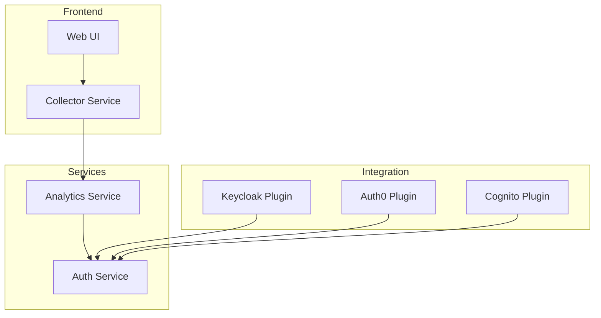

# Keyboard Dynamics Authentication System

## Overview

A standalone authentication system that uses keyboard dynamics for enhanced security. This system can integrate with various identity providers through OAuth2/OpenID Connect.

## Architecture



## Components

### 1. Services

#### Analytics Service
- Processes keyboard dynamics data
- Generates risk scores
- Maintains user profiles
- Provides analytics API

#### Auth Service
- Handles authentication decisions
- Manages user sessions
- Integrates with identity providers
- Provides OAuth2 endpoints

#### Collector Service
- Collects keyboard metrics
- Validates data format
- Handles rate limiting
- Provides collection API

### 2. Frontend

- React-based UI components
- Keyboard data collection
- Real-time analytics dashboard
- Administrative interface

### 3. Integration

- Identity provider plugins
- Webhook integrations
- API clients
- SDK packages

## Setup

1. **Prerequisites**:
   ```bash
   # Install dependencies
   python -m pip install -r requirements.txt
   npm install
   ```

2. **Configuration**:
   ```bash
   # Copy example configs
   cp .env.example .env
   ```

3. **Run Services**:
   ```bash
   # Start services
   docker-compose up
   ```

## Documentation

- [API Documentation](./docs/API.md)
- [Integration Guide](./docs/INTEGRATION.md)
- [Development Guide](./docs/DEVELOPMENT.md)
- [Security Guide](./docs/SECURITY.md)
